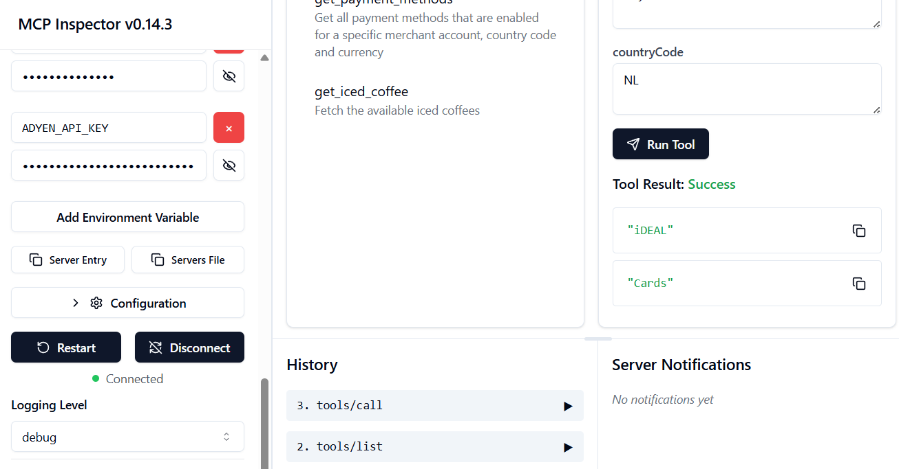

# MCP Server for Adyen Payments and Iced Coffee

This project provides a simple MCP server for models to interact with Adyen's Advanced Flow API.
It also includes a tool for fetching iced coffees if you just want to test MCP but do not have an Adyen API key.

NOTE: this project is a work in progress. It is not ready for any actual use.

## Prerequisites

* ...

## Setup Instructions

1.  **Clone the repository**

2.  **Update Configuration:**

    * **Set the API Key:**
      For local testing, the API key for your target HTTP API should be set as an environment variable named `ADYEN_API_KEY`.
      On Linux/macOS:
        ```bash
        export ADYEN_API_KEY="your_secret_api_key"
        ```
      On Windows (Command Prompt):
        ```bash
        set ADYEN_API_KEY=your_secret_api_key
        ```
      
     By default, the server connects to the TEST environment. You can change this via the environment variable `ADYEN_ENVIRONMENT`.

3.  **Build the Project:**
    Navigate to the root directory of the `mcp-server` project in your terminal and run the following Maven command:
    ```bash
    ./gradlew clean jar
    ```
    This will create a JAR file (likely in the `target` directory).

4.  **Run the MCP Server:**
    After the build is successful, run the JAR file using Java:
    ```bash
    java -jar build/libs/adyen-payments-mcp-server-1.0-SNAPSHOT.jar
    ```
    (The exact JAR file name might vary slightly depending on the Gradle version).

    You should see the output: `Adyen Mcp Server started...`.

## Using the MCP Server

Once the MCP server is running, AI models can use the tools.
If you just want to test this tool out then the MCP Inspector is a great option:
```bash
npx @modelcontextprotocol/inspector java -jar build/libs/adyen-payments-mcp-server-1.0-SNAPSHOT.jar
```

If you want to use the `get_payment_methods` tool then make sure to add the `ADYEN_API_KEY` env variable (see the left sidebar below).
